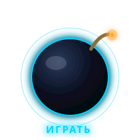
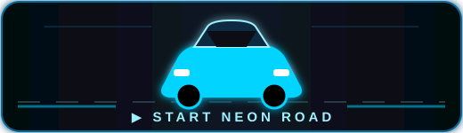
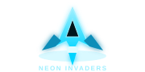
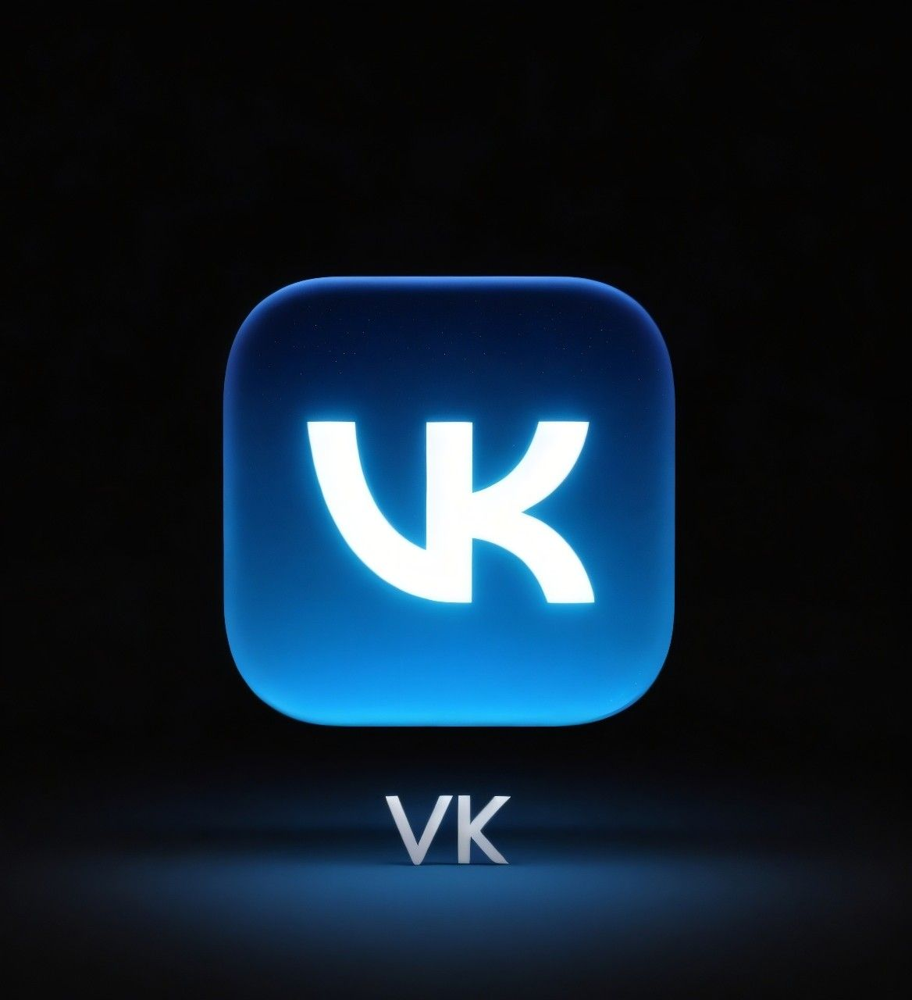

<!-- ═══════════════════════════════════════════════
     🎨 ШАПКА С АВАТАРОМ
     ═══════════════════════════════════════════════ -->

  

<h1>
  
</h1>

  
  

<!-- ═══════════════════════════════════════════════
     📝 ОБО МНЕ
     ═══════════════════════════════════════════════ -->
<h2>
  
</h2>

<table>
  <tr>
    <td>🔭 <b>Сейчас</b></td>
    <td>Работаю над личным проектом</td>
  </tr>
  <tr>
    <td>📫 <b>Связаться</b></td>
    <td><a href="mailto:edembekurov@mail.ru">edembekurov@mail.ru</a></td>
  </tr>
  <tr>
    <td>⚡ <b>Факт</b></td>
    <td>Люблю чистый код и тёмные темы</td>
  </tr>
</table>

<!-- ═══════════════════════════════════════════════
     🛠 ТЕХНОЛОГИИ
     ═══════════════════════════════════════════════ -->
<h2>
  
</h2>

  

<!-- ═══════════════════════════════════════════════
     📊 СТАТИСТИКА (синий неон)
     ═══════════════════════════════════════════════ -->
<h2>
  
</h2>

  
  
  

  

  

<!-- ═══════════════════════════════════════════════
     👾 ПАКМАН (уже перекрашен в неон)
     ═══════════════════════════════════════════════ -->
## 🎮 МОИ КОММИТЫ

 

<!-- ═══════════════════════════════════════════════
     🎮 КНОПКА-БОМБА НА ИГРУ
     ═══════════════════════════════════════════════ -->
<a align="left">
  

     

</a>

<!-- ═══════════════════════════════════════════════
     🔗 СВЯЗАТЬСЯ СО МНОЙ
     ═══════════════════════════════════════════════ -->
<h2>
  
</h2>

  
  

<!-- ═══════════════════════════════════════════════
     🌊 ВОЛНА ВНИЗУ
     ═══════════════════════════════════════════════ -->

  

